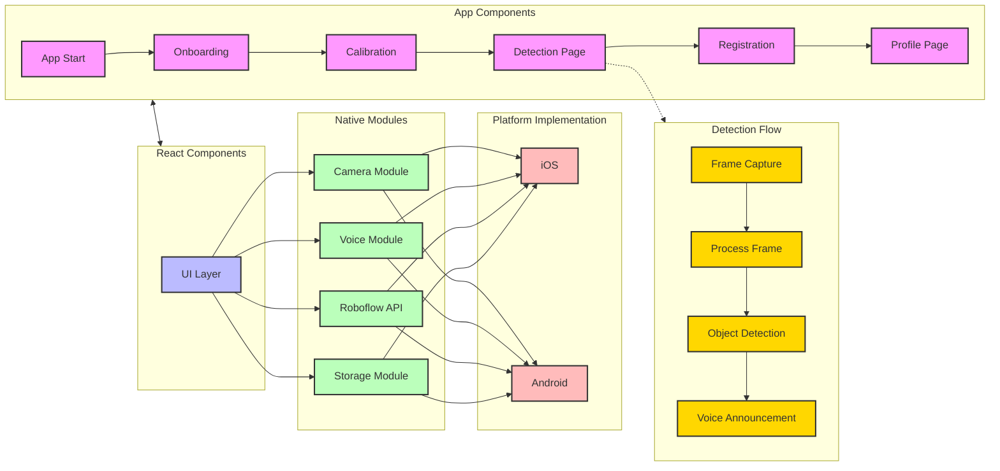
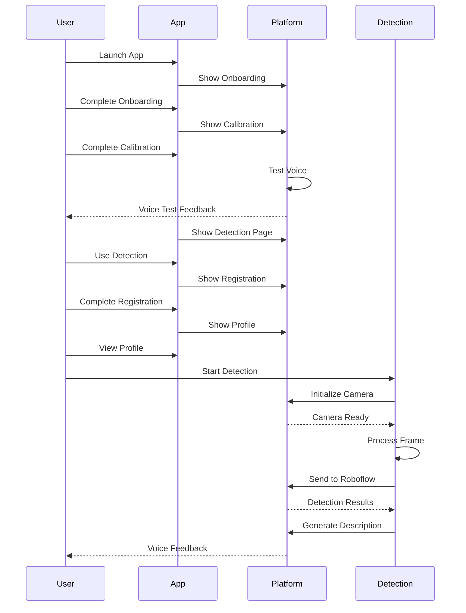

# VisGuide App Component Flow

## App Component Flow Diagram

## Component Interaction Sequence

## Component Descriptions

### App Components
- **App Start**: Entry point of the application
- **Onboarding**: Introduction to app features and capabilities
- **Calibration**: Setup for user preferences and device capabilities, including voice testing
- **Detection Page**: Main screen for object detection
- **Registration**: User account creation and setup
- **Profile Page**: User profile management

### Detection Flow
- **Frame Capture**: Captures image frames from camera
- **Process Frame**: Prepares frames for AI processing
- **Object Detection**: Identifies objects in the frame using Roboflow
- **Voice Announcement**: Converts detection results to speech

### React Components
- **UI Layer**: User interface components and screens

### Native Modules
- **Camera Module**: Controls camera hardware and frame capture
- **Voice Module**: Handles text-to-speech and audio feedback
- **Roboflow API**: Cloud-based object detection service
- **Storage Module**: Manages user data and preferences

### Platform Implementation
- **iOS**: iOS-specific implementations of native modules
- **Android**: Android-specific implementations of native modules

## Key Interactions

1. **App Flow**
   - App starts with onboarding
   - User completes calibration (including voice testing)
   - User goes to detection page
   - User completes registration
   - User accesses profile page

2. **Detection Process**
   - Camera captures frames
   - Frames are sent to Roboflow API for processing
   - Results are converted to voice announcements
   - User receives audio feedback

3. **React to Native Bridge**
   - React components communicate with native modules
   - UI layer triggers native functionality

4. **Native to Platform**
   - Native modules interface with platform-specific implementations
   - Platform handles hardware access and system services
   - Platform-specific optimizations are applied 