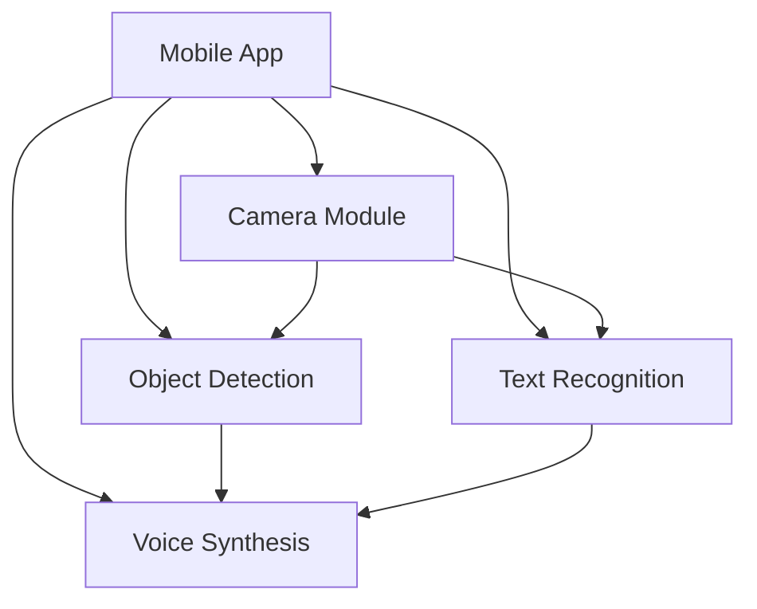
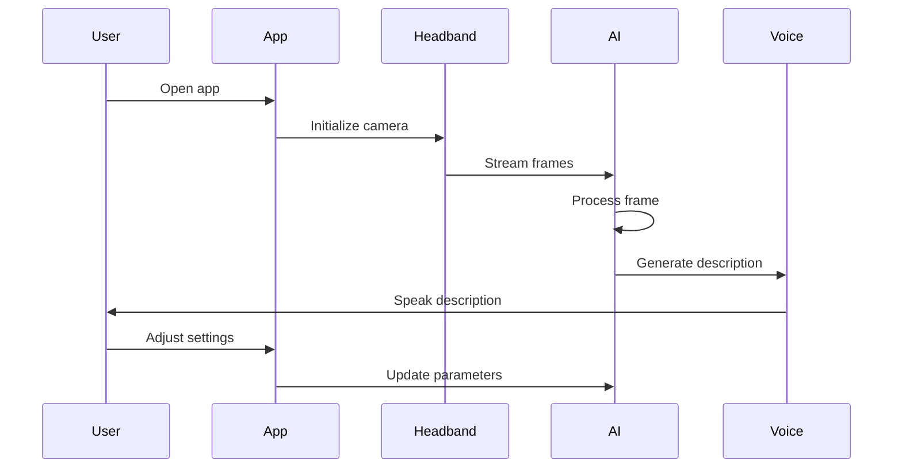
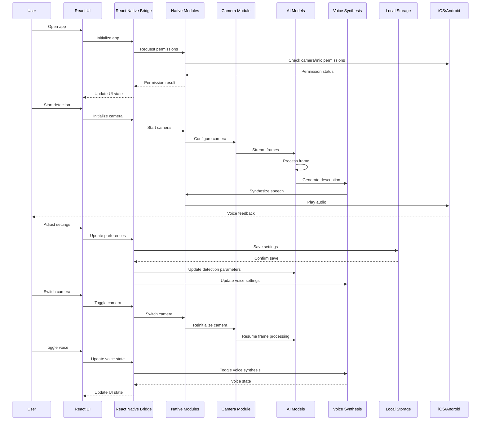

# VisGuide 

## Overview
VisGuide is a device designed to assist visually impaired users by providing real-time object detection, text recognition, and voice guidance. The onboarding app uses advanced AI models to identify objects, read text, and provide audio feedback to help users navigate their environment.

## Features
- Real-time object detection with voice feedback
- Text recognition (OCR) with voice reading
- Voice-guided navigation
- User preferences for voice settings and detection sensitivity
- Profile management with customizable settings

## Technical Architecture

### System Components


### Data Flow


### Complete System Architecture


## Technology Stack
- Frontend: React Native with TypeScript
- AI Models: TensorFlow.js for object detection
- Voice Synthesis: Web Speech API
- Camera: React Native Camera
- State Management: React Context API

## Getting Started

### Prerequisites
- Node.js (v14 or higher)
- React Native development environment
- iOS Simulator or Android Emulator

### Installation
1. Clone the repository
```bash
git clone https://github.com/aziz-1/visguide.git
cd visguide
```

2. Install dependencies
```bash
npm install
```

3. Start the development server
```bash
npm start
```

4. Run on iOS or Android
```bash
npm run ios
# or
npm run android
```

## Project Structure
```
visguide/
├── src/
│   ├── components/     # Reusable UI components
│   ├── screens/        # App screens
│   ├── services/       # Business logic
│   ├── hooks/          # Custom React hooks
│   ├── utils/          # Helper functions
│   └── types/          # TypeScript definitions
├── assets/            # Images, fonts, etc.
└── App.tsx            # Root component
```

## Contributing
1. Fork the repository
2. Create your feature branch (`git checkout -b feature/AmazingFeature`)
3. Commit your changes (`git commit -m 'Add some AmazingFeature'`)
4. Push to the branch (`git push origin feature/AmazingFeature`)
5. Open a Pull Request

## License
This project is licensed under the MIT License - see the [LICENSE](LICENSE) file for details.

## Acknowledgments
- TensorFlow.js team for the object detection models
- React Native community for the excellent framework
- All contributors and testers who helped improve the app
